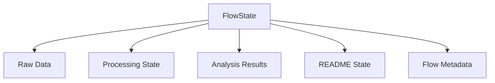

# GitHub GenAI List Architecture

## Overview

The GitHub GenAI List project uses CrewAI flows to implement an event-driven pipeline where deterministic tools handle core processing and LLM agents are called only when needed for analysis and content generation.

## Flow Architecture

### State Management


- **FlowState Model**:
  ```python
  class FlowState(BaseModel):
      raw_repos: List[GitHubRepoData]
      processing: RepoProcessingState
      analyzed_repos: List[RepoAnalysis]
      readme: ReadmeState
      flow_start_time: datetime
      last_updated: datetime
  ```

### Pipeline Stages

#### 1. Fetch Stage (Deterministic)
- GitHub API interaction
- Fetches starred and trending repos
- Updates flow state with raw data
- Error handling and routing

#### 2. Process Stage (Deterministic)
- Batch processing of repos
- Database operations
- State management
- Progress tracking

#### 3. Analysis Stage (Agent-Based)
- LLM agent integration
- Repo categorization
- Quality scoring
- Batch analysis

#### 4. README Stage (Agent-Based)
- Content generation
- Category organization
- Output validation
- File management

## Flow Control

### Event-Driven Processing
```python
class GitHubGenAIFlow(Flow[FlowState]):
    @start()
    def fetch_repos(self) -> PipelineResult:
        """Start by fetching repos from GitHub"""
        return self.fetch_stage.execute(None, self.state)

    @router(fetch_repos)
    def handle_fetch_result(self, result: PipelineResult) -> str:
        """Route based on fetch success/failure"""
        return "success" if result.success else "error"

    @listen("success")
    def process_repos(self) -> PipelineResult:
        """Process fetched repos"""
        return self.process_stage.execute(self.state.raw_repos, self.state)

    @listen(and_(process_repos, analyze_repos))
    def generate_readme(self) -> PipelineResult:
        """Generate README after processing and analysis"""
        return self.readme_stage.execute(self.state.analyzed_repos, self.state)
```

### Error Handling
- Router-based error flow
- State preservation
- Batch cleanup
- Error recovery

## State Management

### Database Integration
- State persistence after each stage
- Transaction management
- Batch processing support
- State cleanup controls

### Progress Tracking
- Processing statistics
- Error tracking
- Performance metrics
- State validation

## Flow Visualization

### Plot Generation
- Interactive HTML visualization
- Stage dependencies
- Error paths
- State transitions

## Benefits

1. **Improved Control Flow**
   - Event-driven execution
   - Clear dependencies
   - Better error handling

2. **Enhanced State Management**
   - Consistent updates
   - Reliable persistence
   - Progress tracking

3. **Better Agent Integration**
   - Focused LLM usage
   - Clear agent boundaries
   - Efficient resource use

4. **Easier Maintenance**
   - Visual flow debugging
   - Clear state transitions
   - Simple error tracking
