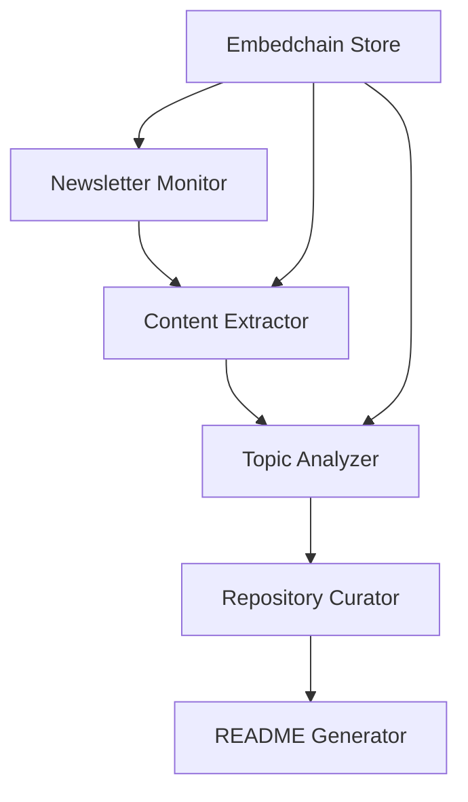
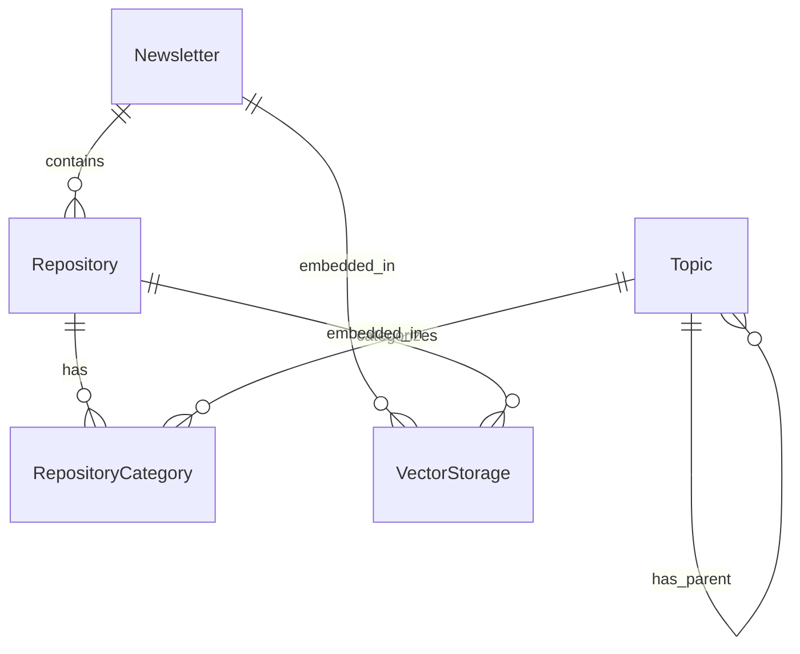
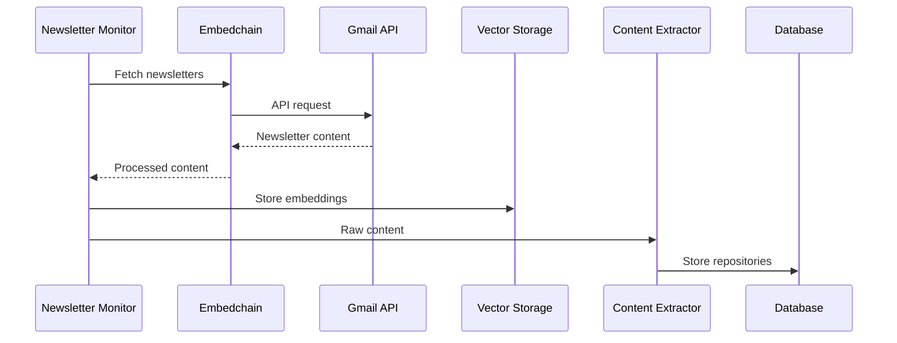
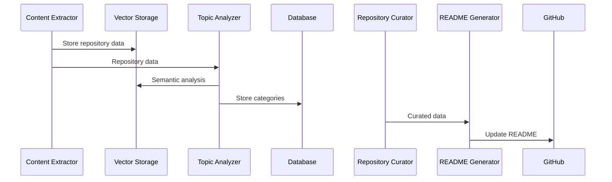
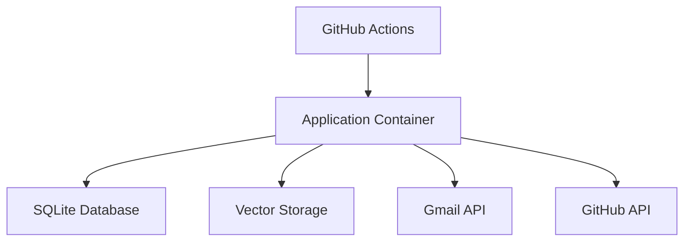

# MVP System Architecture

## Overview

The MVP system is designed to automatically curate GitHub repositories from AI/ML newsletters, organizing them into a structured README. This document outlines the core architecture for the MVP implementation.

## System Components

### 1. Data Collection Layer

#### Gmail Integration with Embedchain
- Embedchain-based Gmail integration for efficient newsletter retrieval
- Vector storage of newsletter content for enhanced analysis
- Basic filtering system for "GenAI News" labeled emails
- Content extraction pipeline with semantic understanding

#### Storage
- SQLite database for structured data
- Embedchain vector storage for:
  - Newsletter content embeddings
  - Repository content embeddings
  - Semantic search capabilities
- Core tables:
  - newsletters (email_id, content, metadata, vector_id)
  - repositories (github_url, metadata, vector_id)
  - topics (name, parent_topic_id)
  - repository_categories (repository_id, topic_id)

### 2. Processing Pipeline



#### Core Agents

1. Newsletter Monitor
   - Uses Embedchain for Gmail interaction
   - Polls Gmail for new newsletters
   - Basic filtering and validation
   - Queues content for processing
   - Stores content in vector storage

2. Content Extractor
   - Extracts GitHub repository links
   - Uses vector storage for content analysis
   - Basic metadata collection
   - Content parsing with semantic context

3. Topic Analyzer
   - Fixed category structure
   - Basic topic identification using embeddings
   - Simple parent/child relationships
   - Semantic similarity for categorization

4. Repository Curator
   - Basic repository metadata storage
   - Vector-based categorization system
   - Minimal duplicate detection
   - Semantic similarity checks

5. README Generator
   - Markdown generation
   - Static category organization
   - Simple repository listing
   - Context-aware organization

### 3. Data Model

#### Core Entities



#### Key Tables

```sql
CREATE TABLE newsletters (
    id INTEGER PRIMARY KEY,
    email_id TEXT NOT NULL UNIQUE,
    received_date TIMESTAMP NOT NULL,
    processed_date TIMESTAMP,
    content TEXT,
    vector_id TEXT,              -- Reference to embedchain storage
    metadata JSON
);

CREATE TABLE repositories (
    id INTEGER PRIMARY KEY,
    github_url TEXT NOT NULL UNIQUE,
    first_seen_date TIMESTAMP NOT NULL,
    last_mentioned_date TIMESTAMP NOT NULL,
    mention_count INTEGER DEFAULT 1,
    vector_id TEXT,              -- Reference to embedchain storage
    metadata JSON
);

CREATE TABLE topics (
    id INTEGER PRIMARY KEY,
    name TEXT NOT NULL UNIQUE,
    parent_topic_id INTEGER,
    FOREIGN KEY (parent_topic_id) REFERENCES topics(id)
);

CREATE TABLE repository_categories (
    id INTEGER PRIMARY KEY,
    repository_id INTEGER NOT NULL,
    topic_id INTEGER NOT NULL,
    confidence_score FLOAT NOT NULL,
    FOREIGN KEY (repository_id) REFERENCES repositories(id),
    FOREIGN KEY (topic_id) REFERENCES topics(id)
);
```

### 4. Processing Flow

1. Newsletter Processing


2. Repository Processing


### 5. Deployment Architecture



- Single container deployment
- GitHub Actions for scheduling
- Local SQLite database
- Embedchain vector storage
- Simple API integrations

### 6. Security & Configuration

#### Security
- Embedchain-managed Gmail API authentication
- GitHub token for README updates
- Local credential storage
- Secure vector storage access

#### Configuration
- Environment variables
- Basic configuration file
- Vector storage configuration
- Minimal customization options

### 7. Error Handling

- Basic retry mechanism
- Simple error logging
- Manual intervention for failures
- Vector storage backup/recovery

### 8. Monitoring & Logging

- Basic operation logging
- Simple status reporting
- Essential error tracking
- Vector storage metrics

## Technical Constraints

### MVP Limitations
1. Fixed category structure
2. Basic semantic analysis
3. Simple categorization logic
4. Minimal error recovery
5. Basic vector search capabilities

### Performance Targets
- Newsletter processing: < 30 seconds
- Daily updates: < 15 minutes
- Vector operations: < 5 seconds
- Basic rate limiting

### Resource Requirements
- Moderate memory footprint for vector operations
- Single-threaded processing
- Vector storage space
- Basic disk storage

## Future Considerations

Features intentionally excluded from MVP:
1. Advanced topic evolution
2. Complex relationship mapping
3. Advanced content summarization
4. Sophisticated monitoring
5. Advanced error recovery
6. Advanced vector search optimizations

These features are documented for future phases but are not part of the initial MVP implementation.
