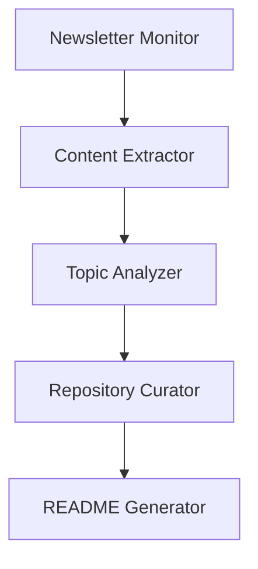
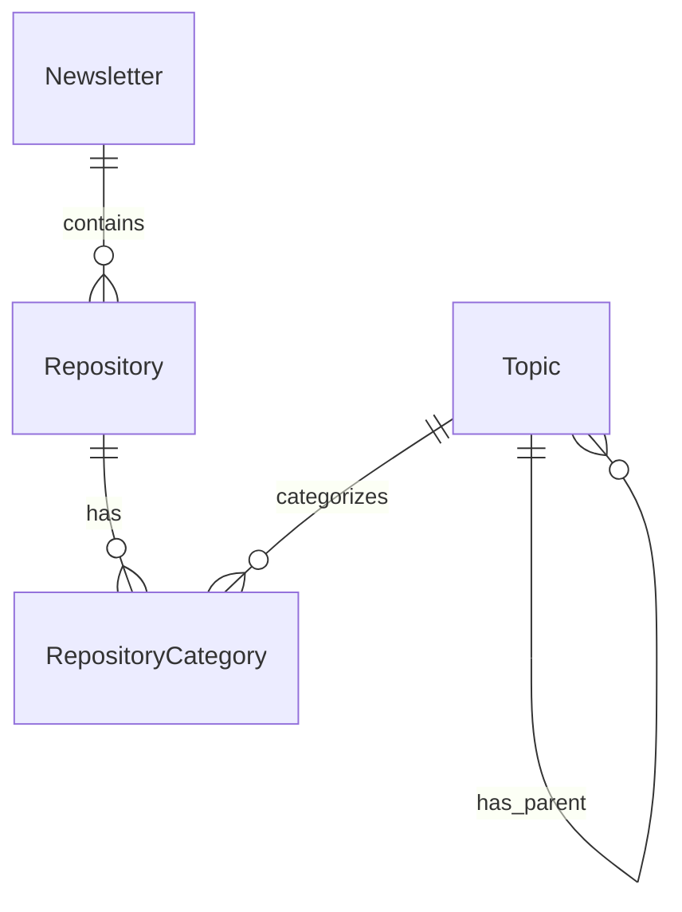
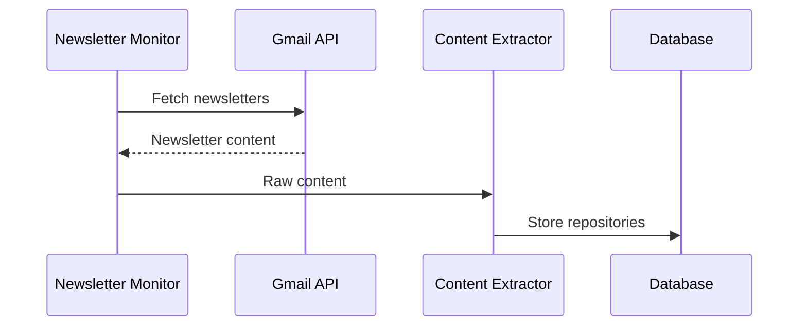
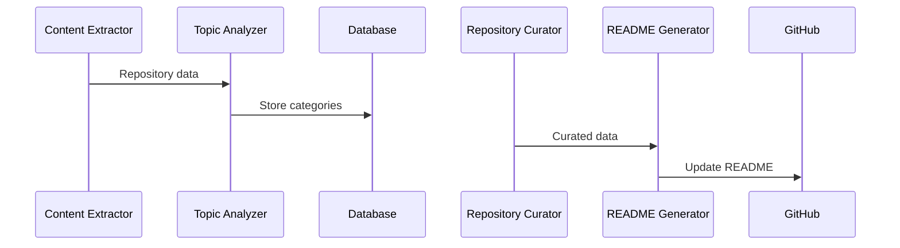
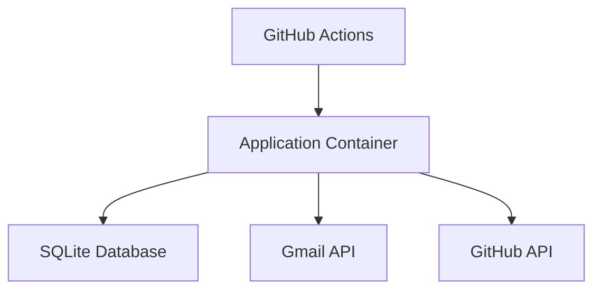

# MVP System Architecture

## Overview

The MVP system is designed to automatically curate GitHub repositories from AI/ML newsletters, organizing them into a structured README. This document outlines the core architecture for the MVP implementation.

## System Components

### 1. Data Collection Layer

#### Gmail Integration
- Simple Gmail API integration for newsletter retrieval
- Basic filtering system for "GenAI News" labeled emails
- Minimal content extraction pipeline

#### Storage
- SQLite database for structured data
- Core tables:
  - newsletters (email_id, content, metadata)
  - repositories (github_url, metadata)
  - topics (name, parent_topic_id)
  - repository_categories (repository_id, topic_id)

### 2. Processing Pipeline



#### Core Agents

1. Newsletter Monitor
   - Polls Gmail for new newsletters
   - Basic filtering and validation
   - Queues content for processing

2. Content Extractor
   - Extracts GitHub repository links
   - Basic metadata collection
   - Simple content parsing

3. Topic Analyzer
   - Fixed category structure
   - Basic topic identification
   - Simple parent/child relationships

4. Repository Curator
   - Basic repository metadata storage
   - Simple categorization system
   - Minimal duplicate detection

5. README Generator
   - Markdown generation
   - Static category organization
   - Simple repository listing

### 3. Data Model

#### Core Entities



#### Key Tables

```sql
CREATE TABLE newsletters (
    id INTEGER PRIMARY KEY,
    email_id TEXT NOT NULL UNIQUE,
    received_date TIMESTAMP NOT NULL,
    processed_date TIMESTAMP,
    content TEXT,
    metadata JSON
);

CREATE TABLE repositories (
    id INTEGER PRIMARY KEY,
    github_url TEXT NOT NULL UNIQUE,
    first_seen_date TIMESTAMP NOT NULL,
    last_mentioned_date TIMESTAMP NOT NULL,
    mention_count INTEGER DEFAULT 1,
    metadata JSON
);

CREATE TABLE topics (
    id INTEGER PRIMARY KEY,
    name TEXT NOT NULL UNIQUE,
    parent_topic_id INTEGER,
    FOREIGN KEY (parent_topic_id) REFERENCES topics(id)
);

CREATE TABLE repository_categories (
    id INTEGER PRIMARY KEY,
    repository_id INTEGER NOT NULL,
    topic_id INTEGER NOT NULL,
    FOREIGN KEY (repository_id) REFERENCES repositories(id),
    FOREIGN KEY (topic_id) REFERENCES topics(id)
);
```

### 4. Processing Flow

1. Newsletter Processing


2. Repository Processing


### 5. Deployment Architecture



- Single container deployment
- GitHub Actions for scheduling
- Local SQLite database
- Simple API integrations

### 6. Security & Configuration

#### Security
- Basic Gmail API authentication
- GitHub token for README updates
- Local credential storage

#### Configuration
- Simple environment variables
- Basic configuration file
- Minimal customization options

### 7. Error Handling

- Basic retry mechanism
- Simple error logging
- Manual intervention for failures

### 8. Monitoring & Logging

- Basic operation logging
- Simple status reporting
- Essential error tracking

## Technical Constraints

### MVP Limitations
1. Fixed category structure
2. No dynamic topic evolution
3. Basic content extraction
4. Simple categorization logic
5. Minimal error recovery

### Performance Targets
- Newsletter processing: < 30 seconds
- Daily updates: < 15 minutes
- Basic rate limiting

### Resource Requirements
- Minimal memory footprint
- Single-threaded processing
- Basic disk storage

## Future Considerations

Features intentionally excluded from MVP:
1. Advanced topic analysis
2. Vector storage capabilities
3. Complex relationship mapping
4. Content summarization
5. Advanced error recovery
6. Sophisticated monitoring

These features are documented for future phases but are not part of the initial MVP implementation.
